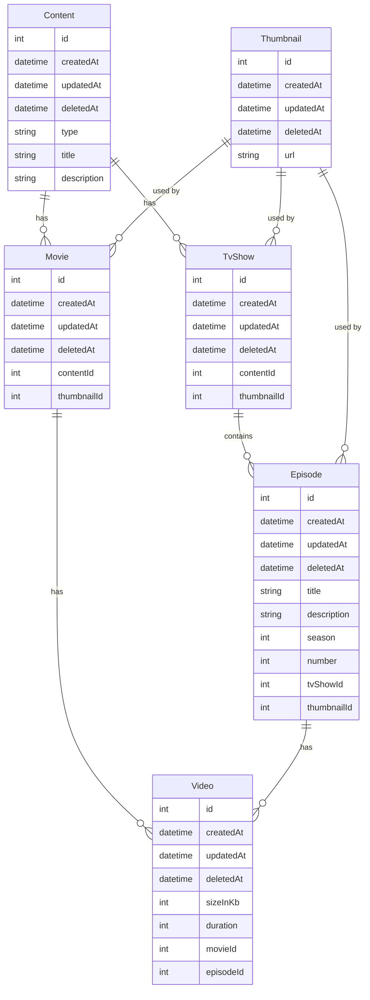

# Foundations of enterprise software development

This course covers building scalable software architectures with a focus on modularity and enterprise patterns. Starting with a streaming MVP, it explores evolutionary design, coupling, module communication (synchronous and asynchronous), and deployment strategies. Practical and theory-driven, it equips developers to create robust, adaptable systems.

## Summary

1. Introduction
2. Building the First Streaming MVP
3. Enterprise Development Patterns
4. Applying Enterprise Patterns
5. Evolutionary Architecture in Practice
6. Building Just Enough
7. Principles of Modular Architecture
8. Coupling and Synchronous Communication Between Modules
9. Asynchronous Communication Between Modules
10. Deploying Modular Architectures

## Introduction

### Docker
See: [[Docker 101]]

### Nest.js

Very interesting to see how the framework is structured and how it encourages the use of modules to organize the codebase.

#### Modules

`nest g resource` can be used to generate a new module. This will create a new module with a controller, service, and a few other files.

```bash
nest-app % nest g resource
? What name would you like to use for this resource (plural, e.g., "users")? users
? What transport layer do you use? REST API
? Would you like to generate CRUD entry points? Yes
CREATE src/users/users.controller.spec.ts (566 bytes)
CREATE src/users/users.controller.ts (894 bytes)
CREATE src/users/users.module.ts (248 bytes)
CREATE src/users/users.service.spec.ts (453 bytes)
CREATE src/users/users.service.ts (609 bytes)
CREATE src/users/dto/create-user.dto.ts (30 bytes)
CREATE src/users/dto/update-user.dto.ts (169 bytes)
CREATE src/users/entities/user.entity.ts (21 bytes)
UPDATE package.json (1977 bytes)
UPDATE src/app.module.ts (312 bytes)
✔ Packages installed successfully.
```

### Prisma ORM

[Set up Prisma ORM](https://www.prisma.io/docs/getting-started/setup-prisma/add-to-existing-project/relational-databases-typescript-postgresql)

```bash
nest-app % npx prisma init

✔ Your Prisma schema was created at prisma/schema.prisma
  You can now open it in your favorite editor.

warn You already have a .gitignore file. Don't forget to add `.env` in it to not commit any private information.

Next steps:
1. Set the DATABASE_URL in the .env file to point to your existing database. If your database has no tables yet, read https://pris.ly/d/getting-started
2. Set the provider of the datasource block in schema.prisma to match your database: postgresql, mysql, sqlite, sqlserver, mongodb or cockroachdb.
3. Run prisma db pull to turn your database schema into a Prisma schema.
4. Run prisma generate to generate the Prisma Client. You can then start querying your database.
5. Tip: Explore how you can extend the ORM with scalable connection pooling, global caching, and real-time database events. Read: https://pris.ly/cli/beyond-orm

More information in our documentation:
https://pris.ly/d/getting-started

```

Applying the schema to the database:

```bash
nest-app % npx prisma db push
Environment variables loaded from .env
Prisma schema loaded from prisma/schema.prisma
Datasource "db": PostgreSQL database "fakeflix", schema "public" at "localhost:5433"

🚀  Your database is now in sync with your Prisma schema. Done in 54ms

✔ Generated Prisma Client (v6.0.0) to ./node_modules/@prisma/client in 31ms
```

### Others

#### Video streaming fundamentals

**Notes**

- Chunks
- HTTP 206 Partial Content
- [How to handle Partial Content in Node.js](https://medium.com/@vishal1909/how-to-handle-partial-content-in-node-js-8b0a5aea216)

### Enterprise Development Patterns

[What is DDD - Eric Evans - DDD Europe 2019](https://youtu.be/pMuiVlnGqjk?si=j3TyfWpb6iJsupq6)

## 4. Applying Enterprise Patterns

- Highlighted the importance of having request and response DTOs on the API layer to decouple the API from the internal domain model.
  - Usage of Nest.js interceptors to transform and **validate** the request and response objects.

```js
  @UseInterceptors(new RestResponseInterceptor(CreateVideoResponseDto))
  async uploadVideo(
    @Req() _req: Request,
    @Body()
```

- Domain-related exceptions vs HTTP exceptions

- DAO vs Repository pattern

ORMs like Django ORM or SQLAlchemy provide high-level abstractions over the database, handling CRUD operations, relationships, and complex queries through an object-oriented API.

In short, DAOs are simpler and focused on persistence, while Repositories are more abstract, working at the domain level and supporting business rules. Use DAOs for straightforward CRUD and Repositories for more complex domain-driven designs.

Interfaces: trade-offs between flexibility and complexity
Try to make decisions based on what's needed now, not what might be needed in the future. If you need to change it later, you can refactor it.

### Domain entities

- Interesting use case: somewhat complex database models can be abstracted into simpler domain entities. Eg: instead of reproducing exactly the database model in the domain model, and having to always check if a content is a movie or a tv show to know which fields to access, we can have a `Content` entity with a `type` field that can be used to determine the type of content.
  We can instead abstract away the complexity of the database model and have a simpler domain model that can be used by the application.

(I've done this before in a project where we had to support both multi-language content and also versioning. The database model was quite complex, but the domain model abstracted away how the data was stored, so we would load in the same object data coming from multiple tables.)




- **`VideoEntity.createNew()` vs `VideoEntity.createNew()`**:  VideoEntity with methods: `createNew(data:NewVideoEntity)` and createFrom(data:VideoEntityProps)`. The former is used to create a new entity from a DTO, while the latter is used to create an entity from an existing object.


