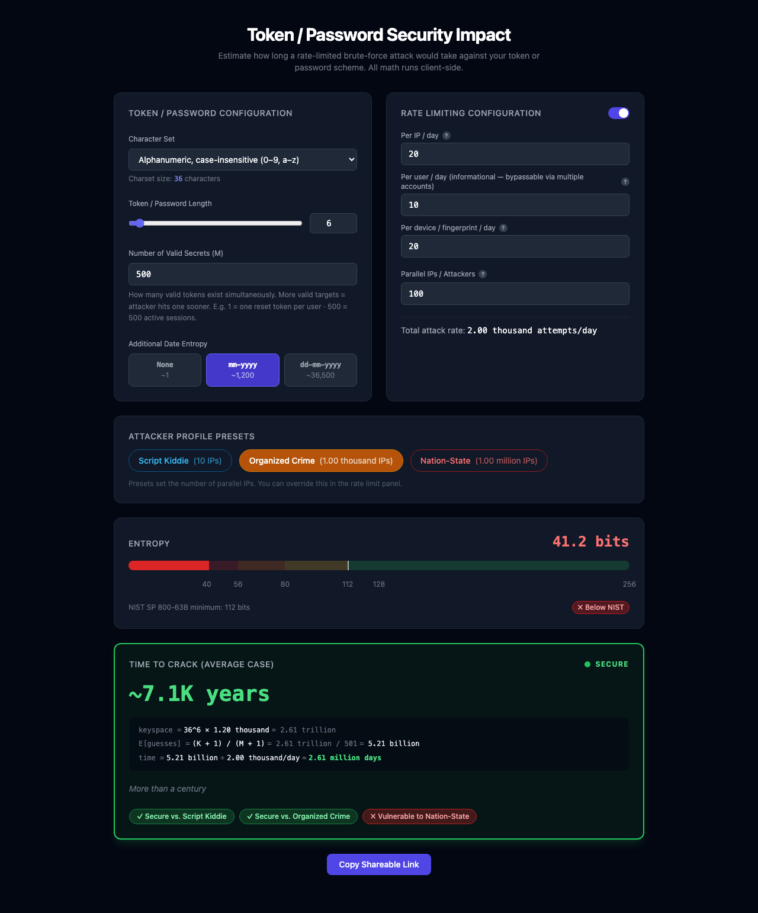

# Token / Password Security Impact

A client-side calculator that estimates how long a rate-limited brute-force attack would take to crack your token or password scheme.



## What it does

Given a token/password configuration and an attacker model, the tool computes:

- **Keyspace** — total number of possible values (`charset_size ^ length × additional_entropy`)
- **Entropy bits** — and whether the scheme meets the NIST 112-bit minimum
- **Effective attack rate** — after applying per-IP, per-user, and per-device rate limits scaled by the number of parallel IPs the attacker controls
- **Time to crack** — expected days/years to find one valid secret (uses the sampling-without-replacement formula `E[guesses] = (K+1) / (M+1)` for M secrets in a keyspace of K)
- **Security tier** — green (>100 years), amber (10–100 years), or red (<10 years)
- **Cosmic context** — human-readable scale from "less than a month" to "beyond the heat death of the universe"

All math runs entirely in the browser — nothing is sent to a server.

## Configuration options

| Section | Controls |
|---|---|
| Token / Password | Character set, token length, additional entropy multiplier, number of valid secrets |
| Rate Limiting | Toggle on/off, raw unthrottled rate, per-IP / per-user / per-device daily limits, parallel IPs |
| Attacker Presets | Script Kiddie (10 IPs), Organized Crime (1 k IPs), Nation-State (1 M IPs) |

## ⚠️ Limitations & Assumptions

This tool provides a simplified model for estimating the strength of claim codes and the expected time-to-compromise under brute-force attack scenarios. It is not a comprehensive security analysis tool and has only been validated against a limited set of specific scenarios and assumptions. The calculations are based on idealised conditions, including uniform randomness of codes, consistent rate limiting, and a defined attacker capability.

As such, the outputs should be interpreted as directional estimates rather than guarantees. Real-world effectiveness may vary depending on factors such as implementation details, enforcement consistency, attacker resources, and system behaviour under load. This tool should be used to support reasoning and discussion, not as a sole basis for security decisions or formal assurance.

## Shareable links

Click **Copy Shareable Link** to get a URL that encodes the current configuration as query parameters — useful for sharing a specific scenario with a colleague.

## Tech stack

- [Vue 3](https://vuejs.org/) (Composition API, `<script setup>`)
- [Vite](https://vitejs.dev/)
- [Tailwind CSS](https://tailwindcss.com/)

## Running locally

```bash
npm install
npm run dev
```

Then open http://localhost:5173.
